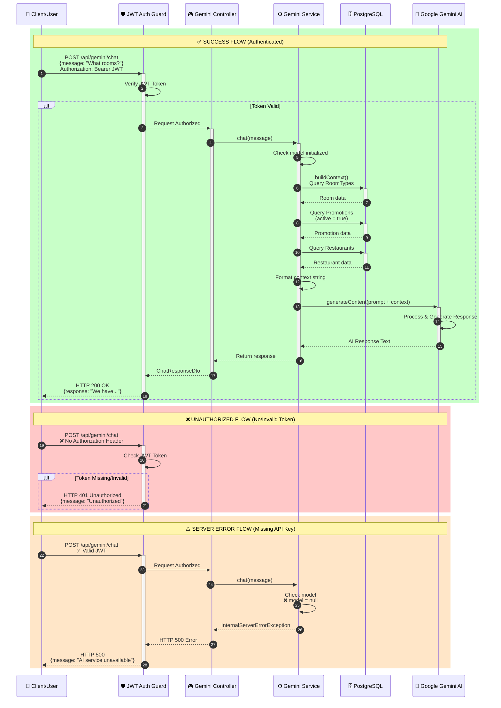
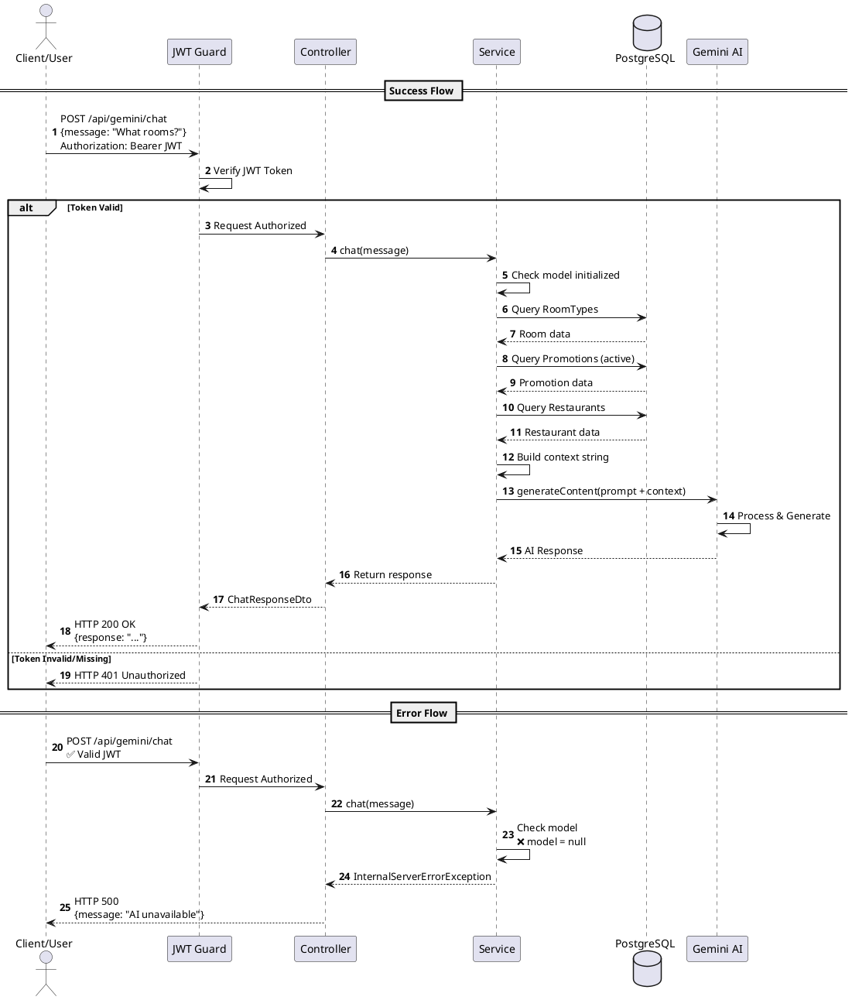

# Gemini Chat Sequence Diagram

## 📊 Sơ Đồ Luồng (Flow Diagram)

### 🔐 Flow 1: Authenticated Request - Success Case
```
User/Client
    │
    │ POST /api/gemini/chat
    │ { "message": "What rooms do you have?" }
    │ Header: Authorization: Bearer <JWT_TOKEN>
    ├─────────────────────────────────────────────────────►
                                                    NestJS Backend
                                                          │
                                            ┌─────────────┴─────────────┐
                                            │   JWT Auth Guard          │
                                            │   - Verify JWT token      │
                                            │   - Extract user info     │
                                            └─────────────┬─────────────┘
                                                          │
                                                    ✅ Token Valid
                                                          │
                                            ┌─────────────┴─────────────┐
                                            │  Gemini Controller        │
                                            │  @Post('chat')            │
                                            └─────────────┬─────────────┘
                                                          │
                                                          │ chat(message)
                                                          ▼
                                            ┌─────────────────────────────┐
                                            │  Gemini Service             │
                                            │  - Check model initialized  │
                                            └─────────────┬───────────────┘
                                                          │
                                                          │ buildContext()
                                                          ▼
                                            ┌─────────────────────────────┐
                                            │  Database (PostgreSQL)      │
                                            │                             │
    ┌───────────────────────────────────────┤  1. Query RoomTypes        │
    │  Room Types Data                      │     SELECT * FROM           │
    │  [Deluxe, Suite, ...]                 │     inventory.room_types   │
    │◄──────────────────────────────────────┤                             │
    │                                       │  2. Query Promotions        │
    │  Promotions Data                      │     SELECT * FROM           │
    │  [SUMMER20, WINTER10, ...]            │     reservation.promotions  │
    │◄──────────────────────────────────────┤     WHERE active = true     │
    │                                       │                             │
    │  Restaurant Data                      │  3. Query Restaurants       │
    │  [Ocean View, ...]                    │     SELECT * FROM           │
    │◄──────────────────────────────────────┤     restaurant.restaurants  │
                                            └─────────────┬───────────────┘
                                                          │
                                            ┌─────────────┴───────────────┐
                                            │  Build Context String       │
                                            │  Format data as text:       │
                                            │  "=== ROOM TYPES ===        │
                                            │   - Deluxe: $150/night      │
                                            │   - Suite: $300/night       │
                                            │   === PROMOTIONS ===        │
                                            │   - SUMMER20: 20% off"      │
                                            └─────────────┬───────────────┘
                                                          │
                                            ┌─────────────┴───────────────┐
                                            │  Construct AI Prompt        │
                                            │  "You are a receptionist    │
                                            │   Context: [DB Data]        │
                                            │   Question: [User Message]" │
                                            └─────────────┬───────────────┘
                                                          │
                                                          │ generateContent(prompt)
                                                          ▼
                                            ┌─────────────────────────────┐
                                            │  Google Gemini AI API       │
                                            │  - Process prompt           │
                                            │  - Generate response        │
    ┌───────────────────────────────────────┤  - Based on context        │
    │  AI Response                          └─────────────┬───────────────┘
    │  "We have Deluxe Room ($150/night)                  │
    │   and Suite ($300/night)..."          ◄─────────────┘
    │◄──────────────────────────────────────┐
                                            │
                                    ┌───────┴────────┐
                                    │  Return to     │
                                    │  Controller    │
                                    └───────┬────────┘
                                            │
    ┌───────────────────────────────────────┤
    │  HTTP 200 OK                          │
    │  {                                    │
    │    "response": "We have Deluxe..."    │
    │  }                                    │
    │◄──────────────────────────────────────┘
    │
User/Client


⏱️ Total time: ~2-5 seconds
```

### ❌ Flow 2: Unauthenticated Request (No Token)
```
User/Client
    │
    │ POST /api/gemini/chat
    │ { "message": "What rooms do you have?" }
    │ ❌ NO Authorization Header
    ├─────────────────────────────────────────────────────►
                                                    NestJS Backend
                                                          │
                                            ┌─────────────┴─────────────┐
                                            │   JWT Auth Guard          │
                                            │   - Check for token       │
                                            │   - Token not found       │
                                            └─────────────┬─────────────┘
                                                          │
                                                    ❌ No Token
                                                          │
    ┌───────────────────────────────────────┬─────────────┘
    │  HTTP 401 Unauthorized                │
    │  {                                    │
    │    "statusCode": 401,                 │
    │    "message": "Unauthorized",         │
    │    "error": "Unauthorized"            │
    │  }                                    │
    │◄──────────────────────────────────────┘
    │
User/Client

⏱️ Total time: ~50ms (fast rejection)
```

### ❌ Flow 3: Invalid/Expired Token
```
User/Client
    │
    │ POST /api/gemini/chat
    │ { "message": "What rooms do you have?" }
    │ Header: Authorization: Bearer <INVALID_TOKEN>
    ├─────────────────────────────────────────────────────►
                                                    NestJS Backend
                                                          │
                                            ┌─────────────┴─────────────┐
                                            │   JWT Auth Guard          │
                                            │   - Verify token          │
                                            │   - jwt.verify() fails    │
                                            └─────────────┬─────────────┘
                                                          │
                                                ❌ Invalid/Expired Token
                                                          │
    ┌───────────────────────────────────────┬─────────────┘
    │  HTTP 401 Unauthorized                │
    │  {                                    │
    │    "statusCode": 401,                 │
    │    "message": "Unauthorized",         │
    │    "error": "Invalid token"           │
    │  }                                    │
    │◄──────────────────────────────────────┘
    │
User/Client

⏱️ Total time: ~100ms
```

### ⚠️ Flow 4: Missing Gemini API Key (500 Error)
```
User/Client
    │
    │ POST /api/gemini/chat (with valid JWT)
    ├─────────────────────────────────────────────────────►
                                                    NestJS Backend
                                                          │
                                                    ✅ Auth Pass
                                                          │
                                            ┌─────────────┴─────────────┐
                                            │  Gemini Service           │
                                            │  - Check model            │
                                            │  ❌ model = null          │
                                            │  (API key not set)        │
                                            └─────────────┬─────────────┘
                                                          │
    ┌───────────────────────────────────────┬─────────────┘
    │  HTTP 500 Internal Server Error       │
    │  {                                    │
    │    "statusCode": 500,                 │
    │    "message": "Gemini AI service is   │
    │               currently unavailable.  │
    │               Please contact support."│
    │  }                                    │
    │◄──────────────────────────────────────┘
    │
User/Client

⚠️ Admin needs to set GEMINI_API_KEY in .env
```

### ⚠️ Flow 5: Database Connection Error
```
User/Client
    │
    │ POST /api/gemini/chat (with valid JWT)
    ├─────────────────────────────────────────────────────►
                                                    NestJS Backend
                                                          │
                                                    ✅ Auth Pass
                                                          │
                                            ┌─────────────┴─────────────┐
                                            │  Gemini Service           │
                                            │  buildContext()           │
                                            └─────────────┬─────────────┘
                                                          │
                                                          │ Query DB
                                                          ▼
                                            ┌─────────────────────────────┐
                                            │  Database (PostgreSQL)      │
                                            │  ❌ Connection Failed       │
    ┌───────────────────────────────────────┤  (Network/Auth error)      │
    │                                       └─────────────┬───────────────┘
    │                                                     │
    │  HTTP 500 Internal Server Error       ◄────────────┘
    │  {
    │    "statusCode": 500,
    │    "message": "Unable to retrieve hotel
    │               information. Please try again later."
    │  }
    │◄──────────────────────────────────────┘
    │
User/Client
```

---

## 🎯 Mermaid Sequence Diagram (Để vẽ trong docs)



---

## 📝 PlantUML Sequence Diagram (Alternative)



---

## 🔍 HTTP Status Codes Summary

| Status Code | Scenario | Message |
|-------------|----------|---------|
| **200 OK** | Success | AI response returned |
| **400 Bad Request** | Invalid input | Validation failed (empty message, etc.) |
| **401 Unauthorized** | No/Invalid JWT | "Unauthorized" |
| **500 Internal Server Error** | Missing API Key | "AI service unavailable" |
| **500 Internal Server Error** | DB Connection Error | "Unable to retrieve hotel information" |
| **500 Internal Server Error** | Gemini API Error | "Unable to process your request" |
| **500 Internal Server Error** | Quota Exceeded | "AI service temporarily unavailable" |

---

## 🚀 Cách Test Các Trường Hợp

### ✅ Test Success (200)
```bash
# 1. Login để lấy JWT
curl -X POST http://localhost:4000/api/auth/login \
  -H "Content-Type: application/json" \
  -d '{"username": "admin", "password": "password"}'

# Response: { "access_token": "eyJhbGc..." }

# 2. Gọi Gemini Chat với JWT
curl -X POST http://localhost:4000/api/gemini/chat \
  -H "Content-Type: application/json" \
  -H "Authorization: Bearer eyJhbGc..." \
  -d '{"message": "What rooms do you have?"}'
```

### ❌ Test Unauthorized (401)
```bash
# Không có Authorization header
curl -X POST http://localhost:4000/api/gemini/chat \
  -H "Content-Type: application/json" \
  -d '{"message": "What rooms do you have?"}'

# Response: 401 Unauthorized
```

### ❌ Test Invalid Token (401)
```bash
# JWT không hợp lệ
curl -X POST http://localhost:4000/api/gemini/chat \
  -H "Content-Type: application/json" \
  -H "Authorization: Bearer invalid_token_xyz" \
  -d '{"message": "What rooms do you have?"}'

# Response: 401 Unauthorized
```

### ⚠️ Test Missing API Key (500)
```bash
# Xóa GEMINI_API_KEY trong .env và restart
# Sau đó gọi API với valid JWT

curl -X POST http://localhost:4000/api/gemini/chat \
  -H "Content-Type: application/json" \
  -H "Authorization: Bearer <valid_jwt>" \
  -d '{"message": "What rooms?"}'

# Response: 500 - "AI service unavailable"
```

---

## 📊 Component Interaction Diagram

```
┌─────────────────────────────────────────────────────────────────┐
│                          Client Layer                            │
│  (Web Browser / Mobile App / API Client)                        │
└───────────────────────────┬─────────────────────────────────────┘
                            │
                            │ HTTP POST /api/gemini/chat
                            │ Authorization: Bearer <JWT>
                            │
┌───────────────────────────▼─────────────────────────────────────┐
│                      NestJS Middleware                           │
│  - Request Logger                                                │
│  - CORS Handler                                                  │
│  - Throttler (Rate Limiting)                                     │
└───────────────────────────┬─────────────────────────────────────┘
                            │
┌───────────────────────────▼─────────────────────────────────────┐
│                      JWT Auth Guard                              │
│  - Extract JWT from Authorization header                         │
│  - Verify token signature (JWT_SECRET)                           │
│  - Check expiration                                              │
│  - Attach user info to request                                   │
└───────────────────────────┬─────────────────────────────────────┘
                            │
                    ✅ Token Valid
                            │
┌───────────────────────────▼─────────────────────────────────────┐
│                    Gemini Controller                             │
│  @Controller('gemini')                                           │
│  @UseGuards(AuthGuard('jwt'))                                    │
│                                                                  │
│  @Post('chat')                                                   │
│  - Validate request body (ChatRequestDto)                        │
│  - Call service.chat(message)                                    │
│  - Return ChatResponseDto                                        │
└───────────────────────────┬─────────────────────────────────────┘
                            │
┌───────────────────────────▼─────────────────────────────────────┐
│                     Gemini Service                               │
│  @Injectable()                                                   │
│                                                                  │
│  1. Check model initialized (API key exists)                     │
│  2. buildContext():                                              │
│     ├─ Query RoomTypes (TypeORM)                                │
│     ├─ Query Promotions (active only)                           │
│     └─ Query Restaurants                                         │
│  3. Format data as context string                                │
│  4. Build AI prompt with context                                 │
│  5. Call Gemini AI API                                           │
│  6. Return AI response                                           │
└───┬────────────────────────┬───────────────────────────────┬────┘
    │                        │                               │
    │                        │                               │
    ▼                        ▼                               ▼
┌─────────┐        ┌───────────────────┐        ┌─────────────────┐
│ Room    │        │   Promotion       │        │   Restaurant    │
│ Type    │        │   Repository      │        │   Repository    │
│ Repo    │        │   (TypeORM)       │        │   (TypeORM)     │
└────┬────┘        └────────┬──────────┘        └────────┬────────┘
     │                      │                            │
     │                      │                            │
     └──────────────────────┴────────────────────────────┘
                            │
                            ▼
            ┌───────────────────────────────┐
            │     PostgreSQL Database       │
            │                               │
            │  - inventory.room_types       │
            │  - reservation.promotions     │
            │  - restaurant.restaurants     │
            └───────────────────────────────┘

                    ┌──────────────────────┐
                    │  Google Gemini AI    │
                    │  (External API)      │
                    │                      │
                    │  - gemini-2.5-flash  │
                    │  - Generate response │
                    └──────────────────────┘
```

---

## 🎓 Key Takeaways

1. **Authentication First**: JWT guard rejects requests BEFORE hitting controller
2. **Fast Failures**: Unauthenticated requests fail in ~50ms (no DB/AI calls)
3. **Real-time Data**: Each request fetches fresh data from database
4. **User-friendly Errors**: Never expose technical details to end users
5. **Logging**: All errors logged for debugging, user sees generic messages
6. **Token Required**: Must login first to get JWT token

---

Bây giờ khi user chưa đăng nhập gọi API sẽ nhận **401 Unauthorized** thay vì 500! 🎉
